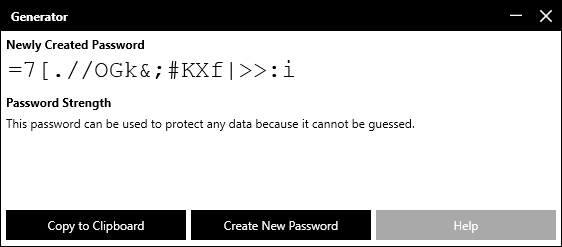
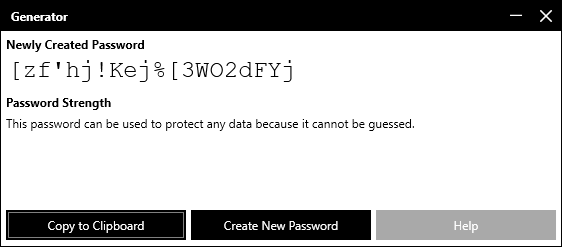
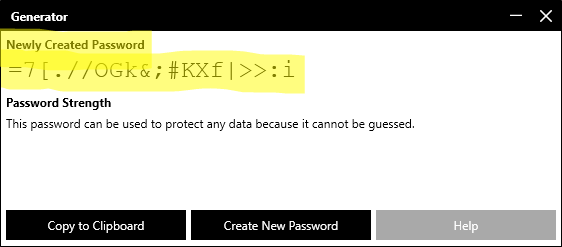
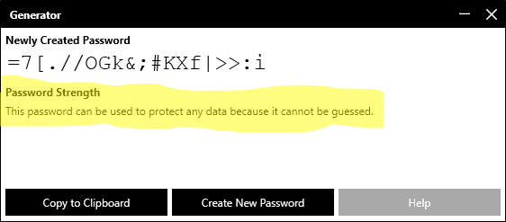
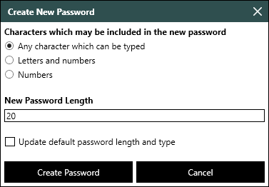

# Generator Windows App Documentation

## How to use it
1. Start the application
2. Wait for the main screen to appear.  This should be quick.  Here is a picture of the main screen:
 
     

     Notice that Generator automatically created a new password when it starts.  It will create a different password each time it starts.  For example, I started it again and here is what it showed me:

     

3. You are done!!!!  Now that the password is created, you can write it down on a piece of paper or copy it to a file if you save your passwords in a file.  You can copy the password to another program by doing the following:
     1. Click on the **Copy to Clipboard** button.
     2. Switch to the other program (like Word)
     3. Paste the password by pressing CTRL+V (i.e. holding down the Control (CTRL) key, pressing the V key and then releasing both keys)

## The Main Screen

The main screen has 3 parts:

1. The section which displays the newly created password (see the highlighted text below)

     

2. The password strength field.  It tells you if a password is strong (no one can guess it), adequate (it can be guessed given enough time and money but is probably good enough) or weak (only use in certain cases like ATM PINs, smart phone screen unlock PINs, USB security key PINs (YubiKey PINs), etc.).  The password strength field is highlighted below:

     

3. The last section is the buttons on the bottom.
     - The **Copy to Clipboard** button to copies the password to the computer’s clipboard.  You can then paste the password into any program by pressing CTRL+V (i.e. holding down the CTRL (Control) key and then pressing the letter V key).
     - The **Create New Password** button brings up the **Create New Password** dialog box.  This dialog box lets you choose a new password’s length and character set.  The character set determines what letters, numbers and/or symbols can be in the password.  For example, a numeric password only has numbers and an alpha-numeric password has numbers, lower-case letters and upper-case letters.
     - The **Help** button displays the **Help** dialog box.  The **Help** dialog box has a link to this documentation, the program's web site and its version.

## Creating a New Password

Sometimes, you want a different password than the one created by default.  Here are some reasons you want a new password:

- You want to create multiple passwords without having to restart the application
- The web site, device or computer you are using does not accept some password characters.  For example, ATM cards only allow numbers in PINs and some web sites disallow certain symbol characters like ' and #.
- You want to use a shorter password because you have a hard time typing in a longer password
- You want to use a shorter password because typing in a longer password is inconvenient
- You have a hard time remembering or writing down symbol characters (i.e. `, ~, !, @, etc.)

Here is how you create a new password:

1. Click on the Create New Password button.  The following dialog box appears:

     

2. Select the characters which can be in the password.  Here are the options:

     - **Any character which can be typed** – This includes lower-case letters, upper-case letters, numbers, punctuation symbols and other symbols (~, !, [, \, |, etc.).  Spaces are not included.  This is the most secure option because each password character can potentially have 94 different values.  This makes it harder to guess a password.  

     - **Letters and numbers** – Only lower-case letters, upper-case letters and numbers can be included in the password.  This type is less secure than the first type because each password character has fewer possible values.  You can compensate for this by making your password 1 to 2 characters longer (i.e. if you were going to have an 8 character password, have a 9 character password or if you were going to have an 11 character password, have a 13 character password).  The advantage of this type of password is it works in web sites which prohibit certain characters (i.e. a site prohibits ‘, #, ", etc.).

     - **Numeric** – This type of password should only be used on devices which can limit the number of password guess.  ATM cards, iPhone PIN lock screen codes and USB security keys are examples of devices which can use PINs securely.  An iPhone will stop letting you try to enter a pass code if you get it wrong too many times (typically, it locks the phone for 1 hour when this occurs).  Another example is a YubiKey (a brand of USB security key) which erases its content if the user gets the password (PIN) wrong 8 times.

3. Check the **Update default password length and type** check box if you want to change the characteristics of the password displayed when the program starts and the default options in the Create New Password dialog box.  For example, lets say you want to always create 10 character alpha-numeric passwords.  If you set the character set to **Letters and numbers**, the password length to 10 and checked the **Update default password length and type** check box, the program would always display a new 10 character alpha-numeric password when it starts.  If the Create New Password dialog box is opened, the **Letters and numbers** radio button would be selected and the length in the New Password Length text box would be 10.

4. Click on the Create Password button to create the password.   The new password will now be displayed in the main window.
